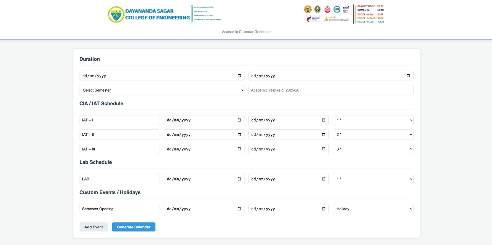
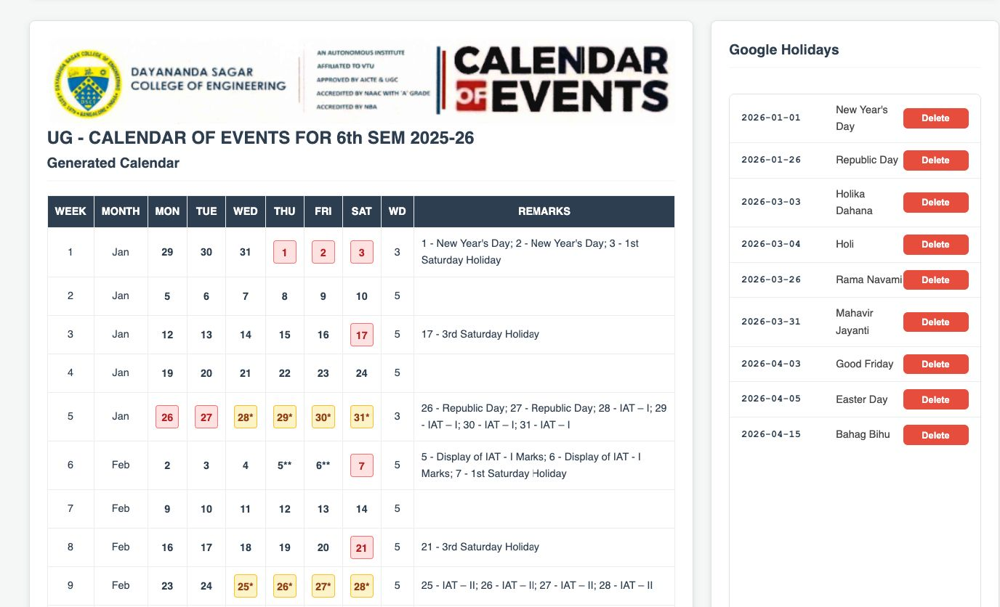
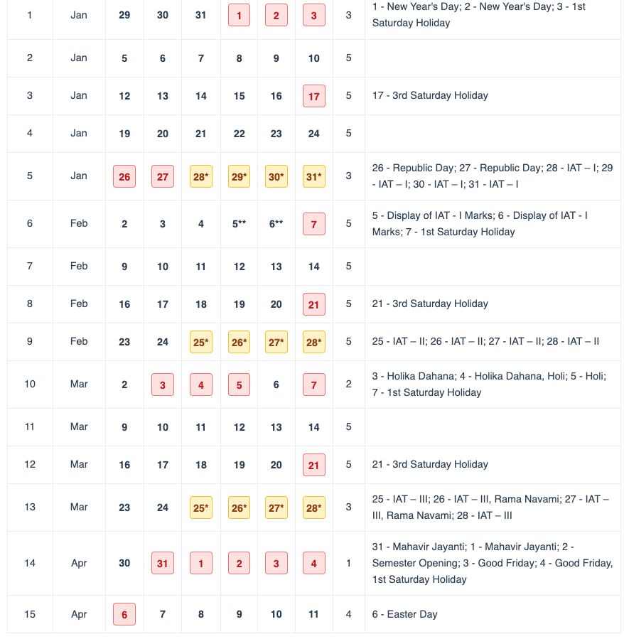

# Academic Calendar Generator

A full-stack web application to generate college academic calendars with CIA/IAT exams, labs, custom events, and holidays pulled from Google Calendar (with SQLite fallback). The tool outputs a week‑wise calendar grid with working days and remarks.

---

## Features

- Enter semester duration, semester number, and academic year.
- Configure CIA/IAT exam windows with star levels.
- Configure lab schedules and custom events/holidays.
- Auto‑fetch government holidays from Google Calendar API with SQLite fallback.[web:8]
- Mark 1st/3rd Saturdays and holidays distinctly (red boxes, stars).
- Week‑wise calendar table with:
  - Week number and month
  - Mon–Sat cells
  - Total working days (WD)
  - Remarks listing events and exams
- Delete specific holidays from the generated list and instantly regenerate the calendar.
- Simple single‑page React UI served by the Express backend.

---

## Tech Stack

- **Frontend:** React (no build step, loaded via CDN), plain CSS.
- **Backend:** Node.js, Express.
- **Database:** SQLite (`calendar.db`) via a small DB helper.
- **External API:** Google Calendar API for holiday data (with local fallback data).
- **Other:** dotenv for environment configuration, CORS enabled for local development.[web:12]

---

## Project Structure

```text
project-root/
├─ public/
│  ├─ index.html
│  ├─ app.js                  # React frontend
│  ├─ styles.css              # Styling for layout, table, banners, etc.
│  ├─ dsce-banner.png         # Main page banner (top of page)
│  └─ dsce-calendar-banner.png# Calendar section banner
├─ server/
│  ├─ server.js               # Express app entry point
│  ├─ routes/
│  │  ├─ calendars.js         # /api/calendars calendar generation endpoint
│  │  └─ holidays.js          # /api/holidays endpoints
│  ├─ googleCalendar.js       # Google Calendar + fallback helpers
│  └─ database.js             # SQLite helpers + holiday cache
├─ .env                       # Environment variables (Google API key, PORT, etc.)
├─ package.json
└─ README.md
```

File/folder names may differ slightly in your repo; adjust accordingly.

---

## Getting Started

### Prerequisites

- Node.js (LTS version recommended, e.g. 18+).[web:12]
- npm or yarn.
- SQLite available on your system (for inspecting the DB; the app can create the DB file automatically).

Optional but recommended:

- A Google API key with access to the Calendar API.[web:8]

### 1. Clone and install

```bash
git clone <your-repo-url> calendar-generator
cd calendar-generator

npm install
```

### 2. Environment variables

Create a `.env` file in the project root:

```env
PORT=3000

# Optional but recommended — Google Calendar API key
GOOGLE_API_KEY=your_google_calendar_api_key_here
GOOGLE_CALENDAR_ID=en.indian#holiday@group.v.calendar.google.com
```

If `GOOGLE_API_KEY` is not set, the backend will use its local fallback holiday data.

### 3. Start the server

```bash
npm start
# or
node server/server.js
```

You should see logs similar to:

```text
🚀 Calendar Generator Server Started
📍 Server running on: http://localhost:3000
📊 Database: SQLite (calendar.db)
🔑 Google API: Configured | NOT CONFIGURED
```

### 4. Open the app

Open your browser at:

```text
http://localhost:3000
```

The React single‑page app is served from the `public/` folder by Express.

---
## Demo Images










